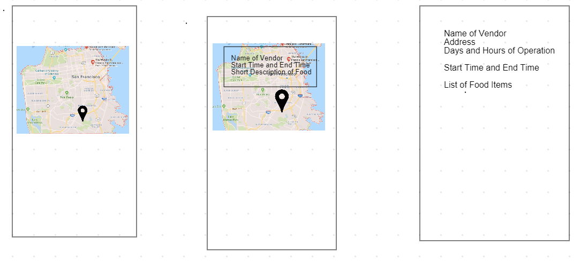

# team-final-project

# Team Members
 * Stanley Liu
 * Wagner Ayllon
 * Brandon Yu
 * Mark Soriano
 
# Milestone 1 Proposal   
Nowadays, food trucks are very hard to locate and rarely do people eat food in this areas as hours of operation of these trucks can vary drastically, making it difficult for people to purchase food. For this project, we want to a create a simple and convenient way for people to find nearby food trucks where they can see the hours of operation as well as to spread the our love of food trucks. The idea is we are going to use google maps api which will display markers for each food truck location as well as the user’s current location. For the data, we are using api from sfgov that lists all the current approved food truck vendors across SF. The user shall be able to see many types of information, for example the types of food that are available and the hours of operation.

# Features 
View all food trucks in SF as markers in a map as well as user’s location 
View description for food trucks that user has clicked 

# Nice to have Features 
Search food trucks based on keyword 
Search food trucks based on certain type of foods 
Search food trucks based on whether store is ‘open’ or ‘closed’ 
Abiltity to bookmark food trucks for future reference 

# Feature Implementation Role 
Owner: Stanley Liu 
ETA: 96 Hours 
Feature: Getting the data from API and parsing json data. 

Owner: Brandon Yu 
ETA: 96 Hours 
Feature: Displaying markers in map view based on coordinates 

Owner: Mark Sorianno 
ETA: 96 Hours 
Feature: Displaying the food truck vendor detail screen 

Owner: Wagner Allono 
ETA: 96 Hours 
Feature: Ability to bookmark food truck vendors for future reference 

# Basic Wireframes

