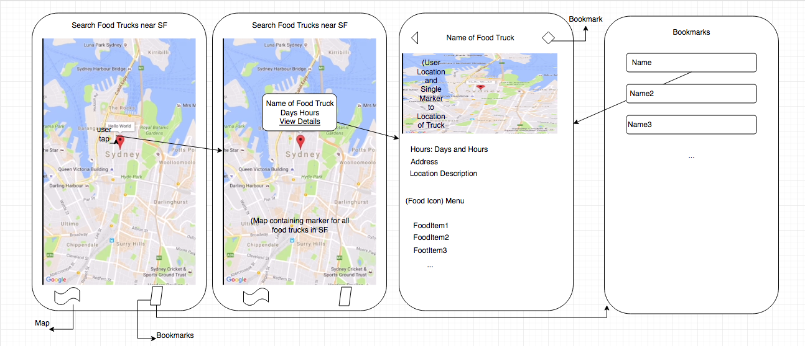

# team-final-project

## Team Members
 * Stanley Liu
 * Wagner Ayllon
 * Brandon Yu
 * Mark Soriano

## Milestone 1 Proposal
Nowadays, food trucks are very hard to locate and rarely do people eat food in this areas as hours of operation of these trucks can vary drastically, making it difficult for people to purchase food. For this project, we want to a create a simple and convenient way for people to find nearby food trucks where they can see the hours of operation as well as to spread the our love of food trucks. The idea is we are going to use google maps api which will display markers for each food truck location as well as the user’s current location. For the data, we are using api from sfgov that lists all the current approved food truck vendors across SF. The user shall be able to see many types of information, for example the types of food that are available and the hours of operation.

## Features 
Populate all the foodtrucks in SF as markers in a map as well as user’s location 
View description for food trucks that user has clicked as markers on the map 
Include various details, such as food truck name, food items, business hours, food truck location, etc... 

## Nice to have Features 
Out of class scope.
* Search for specific food items/type of foods, maybe category based
* Expanding dataset to show more food trucks
* Make it easier to remove and edit bookmarks

## Feature Implementation & Roles 
Owner: Stanley Liu 
ETA: 96 Hours 
Feature: Bookmark and Clustering the map 

Owner: Brandon Yu 
ETA: 96 Hours 
Feature: NearbyList, AnnotationView, Displaying map 

Owner: Mark Sorianno 
ETA: 96 Hours 
Feature: FoodTruckDetail, Segue Annotations, displaying food truck details 

Owner: Wagner Allono 
ETA: 96 Hours 
Feature: Directions via walk and car, eta, and distance in FoodTruckDetail 

## Wireframes

